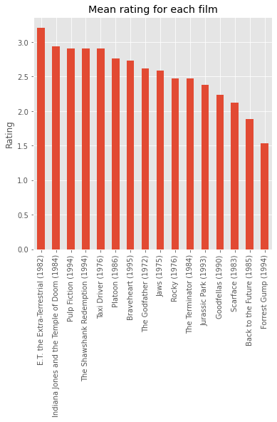
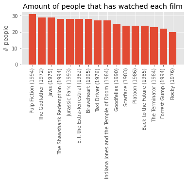
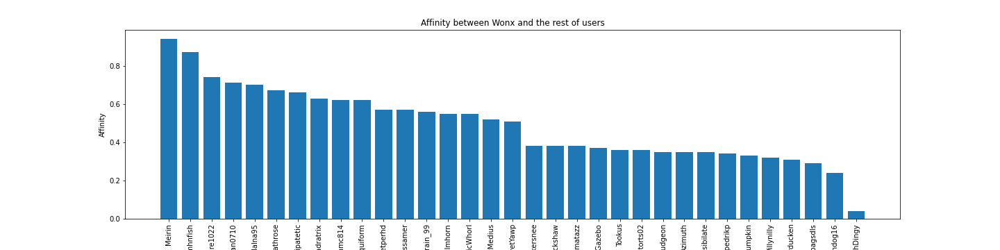
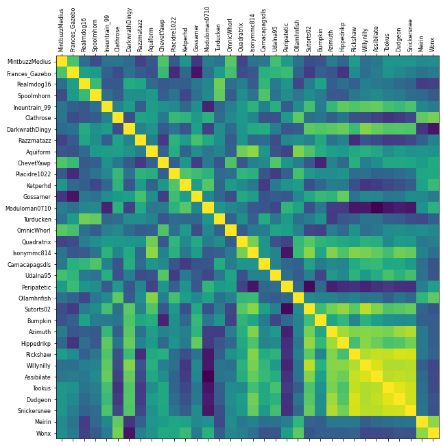

# Film recommender system
This is an example of a recommender system, used to provide suggestions for items that better a particular use and predict their preferences. Similar systems can be found in online stores, used to display articles that might be interesting to the user, on social networks to recommend content and similar-minded users, or in restaurant and delivery apps to predict places that match the user's tastes, among many other situations.

In this example, the recommender system is used to suggest movies to a particular user, based on the overall movie ratings and the taste of similar-minded users.

Table of contents
=================

* [Files](#files)
* [Data acquisition and preparation](#data-acquisition-and-preparation)
* [Algorithms](#algorithms)
  * [Euclidean distance](#euclidean-distance)
  * [Pearson correlation](#pearson-correlation)
* [User affinity](#user-affinity)
* [Film statistics](#film-statistics)
* [Recommendations](#recommendations)
* [Plots](#plots)
* [Data output](#data-output)

## Structure

### Files

- [Main.ipynb](Main.ipynb): starting point. Jupyter notebook encompassing the instructions to read the data, calculate the affinity between users, generate the recommendations, plot the graphs and produce output in csv and png format.

- Classes:
	- [filemanager.py](classes/filemanager.py): module that includes the `read_input_file()`,  `store_recommended_film()`, `store_personalized_films()` functions, to read the data source, save the recommendations in a general file, or for a user in particular (in `csv` format), respectively.

	- [persona.py](classes/persona.py): this module contains the `Persona` class, responsible for the creation of the `persona` objects that store all the user data, like the username, ratings, and the classification table. It also includes methods that return this information in an orderly manner.

	- [distancia.py](classes.distancia.py): composed by the abstract class `Distancia(ABC):`, with the subclasses `DistanciaEuclidiana(Distancia)` and `DistanciaPearson(Distancia)`, which are in charge of calculating the distance between users with the two respective algorithms. Moreover, it contains the `newrange()` methods to addapt the score ranges.

	- [filmstats.py](classes/filmstats.py): module that contains a set of functions to extract statistical data related to the movies. For instance, `filmmeans(person)` provides the mean ratings for each film; `mostseen()` shows the most popular movies; `notseen(person)` display those moves that have not been watched by a specific user; and `soulmates(persona)` returns those users with whom the reference user shows closer tastes.

	- [makegraphs.py](classes/makegraphs.py): this module includes the `input_graphs()`, `intermediate_graphs() `, `output_graphs()`, `recommendations_graph()` and `rating_histogram()` functions aimed to generate a set of plots for the processed data

	- [recommendations.py](classes/recommendations.py): includes the class `Recommendation`, and inside, the method `classificationtable()`, which generates the classification table for the `Person` objects, by invoking the distance calculation methods in the `distancia.py` module. In this class constructor, the recommendations for non-watched films are calculated for the specified user.

### Data acquisition and preparation

The recommender system depends on a dataset containing a series of movie ratings for a number of users. The dataset included ([input/import.csv](input/import.csv)) has been randomly generated for demonstration purposes, where ratings are stored as numerical values ranging from 1 to 5. A 0 value indicates that a particular film has not been watched by a user.

### Algorithms

The abstract method `.Dist()` in [distancia.py](classes/distancia.py) receives the two usernames to compare as two instances of the `Persona` object, and the distance algorithm we want to use (`euclidean` or `pearson`).

#### Euclidean distance
*[(Read wikipedia article)](https://en.wikipedia.org/wiki/Euclidean_distance)*

The Euclidean distance is the lengh of a line segment between two points (in this case, movie rating pairs between two users) in an euclidean space. The result will be a value between -1 and 1. A higher value indicates a higher affinity between users. The calculation is done through the `np.corrcoef()` from the *NumPy* library. 

*(Note: due to limitations in the algorithm, the distance cannot be computed if there are less than 4 rating pairs, or if all the ratings for a user are the same one (e.g. `[4, 4, 4, 4, 4, 4]`).* 

#### Pearson correlation
*[(Read wikipedia article)](https://en.wikipedia.org/wiki/Pearson_correlation_coefficient)*

It is a measure of the correlation between two datapoints. The result will be a value between 0 and 4 (the difference in the rating range, where people can vote from 1 to 5). Broadly speaking, since it is a unidimensional variable, the distance for each rating pair is calculated with the `np.sqrt(np.sum((p[i]-q[i])**2))` formula and these values are then averaged (with the help of `np.nanmean(distance)`.

### User affinity

Each object `persona` stores a `classification_table`, a list of dictionaries containing the rest of the users, their affinity, and the affinity-corrected rating (the product of the rating and the distance).

For example:

> The user `Hippedrikp` rated `Taxi Driver (1976)` with a `5` out of 5, and the affinity (distance) with the selected username is `0.64`, therefore, the corrected rating will be `3.18`).

The table would look like this:

|    | Critic         | AFfinity |   |   |
|----|----------------|----------|---|---|
| 32 | Wonx           | 0.94     |   |   |
| 21 | Ollamhnfish    | 0.86     |   |   |
| 4  | Ineuntrain_99  | 0.78     |   |   |
| 5  | Clathrose      | 0.74     |   |   |
| 8  | Aquiform       | 0.73     |   |   |
| 19 | Udalna95       | 0.70     |   |   |
| 9  | ChevetYawp     | 0.68     |   |   |
| 22 | Sutorts02      | 0.65     |   |   |
| 0  | MintbuzzMedius | 0.62     |   |   |
| 13 | Moduloman0710  | 0.61     |   |   |
| 17 | Isonymmc814    | 0.60     |   |   |
| 10 | Placidre1022   | 0.60     |   |   |

We can display the table by using the method `.get_classificationtable(title)`.

**Note: There's a second correction, by popularity, that is is applied only when the recommendations are generated (explained in its own section).*

### Film statistics

The module `filmstats.py` allows us to visualize some film statistics, although these functions are used internally in other functions and methods.

For instance, there is the function `mostseen()` that shows a list of the movies with most views. `notseen()` that returns a list of movies not seen by the user, or `soulmates()` that returns a dictionary with those users closer in tastes to the reference username, above a specified threshold.

|    | Title                                       | Seen by | % of users |   |
|----|---------------------------------------------|---------|------------|---|
| 0  | Pulp Fiction (1994)                         | 31/34   | 91.18      |   |
| 1  | The Godfather (1972)                        | 29/34   | 85.29      |   |
| 2  | Jaws (1975)                                 | 29/34   | 85.29      |   |
| 3  | Jurassic Park (1993)                        | 28/34   | 82.35      |   |
| 4  | E.T. the Extra-Terrestrial (1982)           | 28/34   | 82.35      |   |
| 5  | The Shawshank Redemption (1994)             | 28/34   | 82.35      |   |
| 6  | Braveheart (1995)                           | 28/34   | 82.35      |   |
| 7  | Indiana Jones and the Temple of Doom (1984) | 27/34   | 79.41      |   |
| 8  | Taxi Driver (1976)                          | 27/34   | 79.41      |   |
| 9  | Goodfellas (1990)                           | 25/34   | 73.53      |   |
| 10 | Back to the Future (1985)                   | 24/34   | 70.59      |   |
| 11 | Platoon (1986)                              | 24/34   | 70.59      |   |
| 12 | Scarface (1983)                             | 24/34   | 70.59      |   |
| 13 | The Terminator (1984)                       | 23/34   | 67.65      |   |
| 14 | Forrest Gump (1994)                         | 22/34   | 64.71      |   |
| 15 | Rocky (1976)                                | 20/34   | 58.82      |   |

### Recommendations

Recommendations are obtained through the class `Recommendation` within the module `recommendation.py`.
This class, to which we pass the referenced username, the list of `people` objects, and the minimum rating threshold for a recommendation, will create an object (stored in `c`) containing the recommendations. These recommendations are accessed through the `.get_recommendation()` method, which will return a dictionary with the movie title as the key, and its corrected rating for the username as the value.

Internally, it checks which films have not been watched by the user (`notseen()` function), and using the mean of the corrected ratings for each user (`filmmeans()` function) for these films, a correction for popularity is applied (multiplying the viewing ration for each film (`mostseen()`) and checks if a particular film is over the rating threshold that we specified.

For instance:

> We use a `0.65` threshold (over a theoretical maximum value of 5). `notseen()` tells us that `Wonx` has not watched `Indiana Jones and the Temple of Doom (1984)`, `Rocky (1976)` or `Forest Gump (1994)`, among others. `Indiana Jones and the Temple of Doom (1984)` has a corrected rating of `1.35` (we can check that in its `classification_table`), and, since it's a movie seen by `79.41%` of the users, the popularity corrected rating will be `1.07`. Since it's over the `0.65` threshold, it will be recommended. However, `Forest Gump (1994)` has a popularity corrected rating of `0.49`, therefore it won't recommended to the user.

Recommendations for user `Wonx`:
|   | Rank | Title                                       | Rating | Rating (popularity-corrected) |
|---|------|---------------------------------------------|--------|-------------------------------|
| 0 | 1    | Indiana Jones and the Temple of Doom (1984) | 1.83   | 1.07                          |
| 1 | 2    | Platoon (1986)                              | 1.52   | 0.84                          |
| 2 | 3    | Goodfellas (1990)                           | 1.32   | 0.8                           |
| 3 | 4    | Scarface (1983)                             | 1.29   | 0.76                          |
| 4 | 5    | The Terminator (1984)                       | 1.14   | 0.75                          |
| 5 | 6    | Rocky (1976)                                | 1.12   | 0.65                          |

### Plots

A series of plots can be generated using the `makegraphs.py` class to visualize more clearly the obtained data.

 - Film ratings
  

   

 - Film popularity

 - Recommendations
    

 - User affinity (bar graph)
 

 - User affinity (heatmap)
  

### Data output
